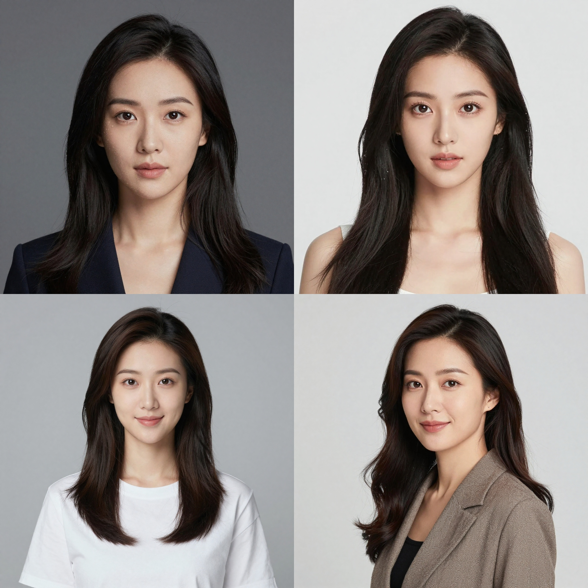
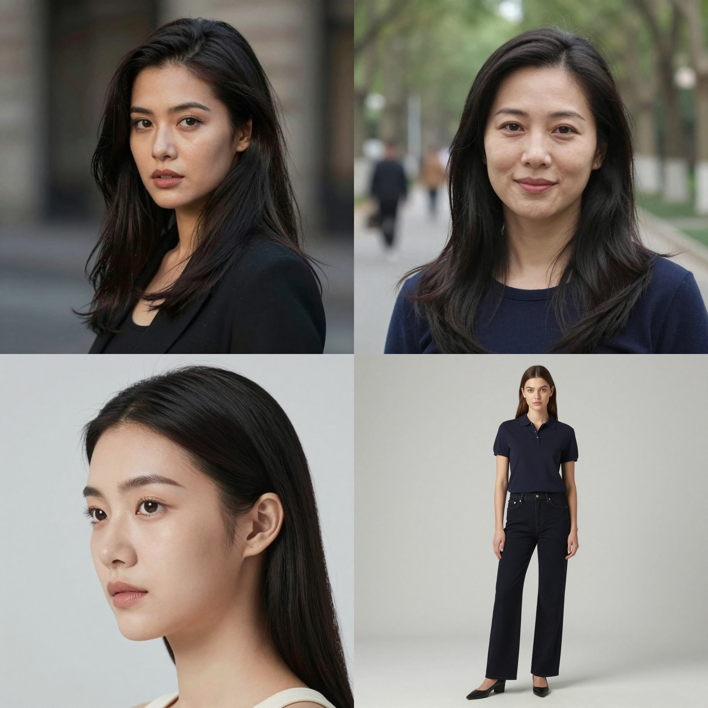

# SD Forge SVE
This is an Extension for [Forge Neo](https://github.com/Haoming02/sd-webui-forge-classic), which improves the run-to-run variance for distilled models

### Example

- Generate `a photo of a woman` using **Z-Image-Turbo** with the same Seed

<table>
  <tr>
    <th>Default</th>
    <th>SVE</th>
  </tr>
  <tr>
    <td></td>
    <td></td>
  </tr>
</table>

- **Reference:** https://github.com/ChangeTheConstants/SeedVarianceEnhancer
